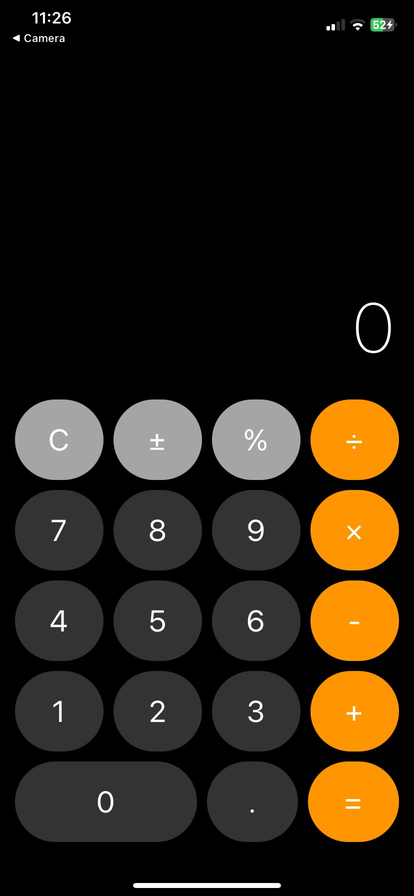

# iOS Calculator App

A fully functional iOS-style calculator built with React Native and Expo. This calculator replicates the classic iOS calculator design with a clean, minimalist interface and smooth touch interactions.



## ✨ Features

- ✅ **Basic Operations**: Addition, subtraction, multiplication, division
- ✅ **Special Functions**: 
  - Clear (C)
  - Toggle positive/negative (±)
  - Percentage (%)
  - Decimal point (.)
- ✅ **iOS-Style Design**: Black background with gray and orange buttons
- ✅ **Responsive Layout**: Adapts to different screen sizes
- ✅ **Touch Feedback**: Buttons respond with visual feedback when pressed
- ✅ **Real-time Display**: Shows current calculation result

## 🎨 Design

The app features the iconic iOS calculator design:
- **Black background** for the main container
- **Dark gray buttons** for numbers (0-9)
- **Light gray buttons** for functions (C, ±, %)
- **Orange buttons** for operations (+, -, ×, ÷, =)
- **Large display** at the top showing results
- **Circular buttons** with proper spacing

## 🚀 Getting Started

### Prerequisites

- Node.js (v18 or newer)
- npm or yarn
- Expo Go app on your iPhone (download from App Store)
- Windows, Mac, or Linux computer

### Installation

1. **Clone or download this repository**
   ```bash
   cd CalculatorApp
   ```

2. **Install dependencies**
   ```bash
   npm install
   ```

3. **Start the development server**
   ```bash
   npx expo start
   ```

   For school/restricted WiFi networks:
   ```bash
   npx expo start --tunnel
   ```

4. **Run on your device**
   - Open Expo Go on your iPhone
   - Scan the QR code from your terminal
   - The app will load on your device!

## 📱 Testing

### On iPhone (Recommended)
1. Install Expo Go from the App Store
2. Make sure your phone and computer are on the same WiFi network
3. Scan the QR code from the terminal
4. The calculator will load instantly

### In Web Browser
1. Start the dev server: `npx expo start`
2. Press `w` to open in your web browser
3. Test the calculator directly in Chrome/Edge

## 🎯 How to Use

1. **Enter numbers**: Tap any number button (0-9)
2. **Perform operations**: 
   - Tap +, -, ×, or ÷ to select an operation
   - Enter the second number
   - Tap = to see the result
3. **Clear**: Tap C to reset the calculator
4. **Toggle sign**: Tap ± to make numbers positive/negative
5. **Percentage**: Tap % to convert to percentage
6. **Decimal**: Tap . to add decimal points

## 📂 Project Structure

```
CalculatorApp/
├── App.js              # Main calculator component
├── package.json        # Project dependencies
├── app.json           # Expo configuration
└── node_modules/      # Installed packages
```

## 🛠️ Built With

- **React Native** - Framework for building native apps
- **Expo** - Platform for universal React applications
- **JavaScript** - Programming language
- **React Hooks** - State management (useState)

## 💡 How It Works

### State Management
The calculator uses React's `useState` hook to manage:
- **display**: Current number shown on screen
- **previousValue**: First number in the calculation
- **operation**: Selected operation (+, -, ×, ÷)
- **resetDisplay**: Flag to know when to start a new number

### Calculation Flow
1. User enters first number → stored in `display`
2. User taps operation → `display` moves to `previousValue`
3. User enters second number → stored in `display`
4. User taps = → calculation performed → result shown

### Core Functions
- `handleNumberPress`: Adds digits to the display
- `handleOperationPress`: Stores operation and first number
- `calculate`: Performs the actual math operation
- `handleEquals`: Executes calculation and shows result
- `handleClear`: Resets everything to initial state

## 🎨 Customization

Want to customize the calculator? Here are some easy modifications:

### Change Colors
In `App.js`, modify the `StyleSheet`:

```javascript
// Background color
backgroundColor: '#000',  // Change to any color

// Number buttons
backgroundColor: '#333',  // Dark gray

// Function buttons (C, ±, %)
backgroundColor: '#a5a5a5',  // Light gray

// Operation buttons (+, -, ×, ÷, =)
backgroundColor: '#ff9500',  // Orange
```

### Change Button Size
```javascript
// Display text size
fontSize: 70,  // Make it bigger or smaller

// Button text size
fontSize: 30,  // Adjust button numbers
```

### Add New Operations
Add a square root function:

```javascript
const handleSquareRoot = () => {
  setDisplay(String(Math.sqrt(parseFloat(display))));
};
```

Then add a button:
```javascript
<Button text="√" onPress={handleSquareRoot} style={styles.functionButton} />
```

## 🐛 Troubleshooting

### "Cannot connect" error on phone
- **Solution**: Use tunnel mode: `npx expo start --tunnel`
- Make sure both devices are on the same WiFi
- School/public WiFi may block connections

### QR code not scanning
- Try pressing `r` in terminal to reload
- Check that Expo Go is up to date
- Manually type the URL shown in terminal into Expo Go

### App shows blank screen
- Check terminal for error messages
- Make sure all dependencies are installed: `npm install`
- Verify `App.js` code is correct

### Warning messages in terminal
- Most warnings are harmless and won't affect functionality
- The app will still work on your phone

## 📝 To-Do / Future Enhancements

- [ ] Add scientific calculator mode
- [ ] Add calculation history
- [ ] Support landscape orientation
- [ ] Add keyboard input support
- [ ] Add themes (light/dark mode)
- [ ] Add memory functions (M+, M-, MR, MC)
- [ ] Add haptic feedback
- [ ] Add sound effects

## 🤝 Contributing

Want to improve this calculator? Feel free to:
1. Fork the project
2. Create a feature branch
3. Make your changes
4. Test thoroughly
5. Submit a pull request

## 📄 License

This project is open source and available for educational purposes.

## 👤 Author

Built as a learning project for iOS app development using React Native.

## 🙏 Acknowledgments

- Design inspired by Apple's iOS Calculator
- Built with React Native and Expo
- Thanks to the React Native community for excellent documentation

## 📞 Support

Having issues? Here are some resources:
- [Expo Documentation](https://docs.expo.dev/)
- [React Native Documentation](https://reactnative.dev/)
- [Expo Community Forums](https://forums.expo.dev/)

---

**Made with ❤️ using React Native + Expo**

*Note: This is an educational project and not affiliated with Apple Inc.*